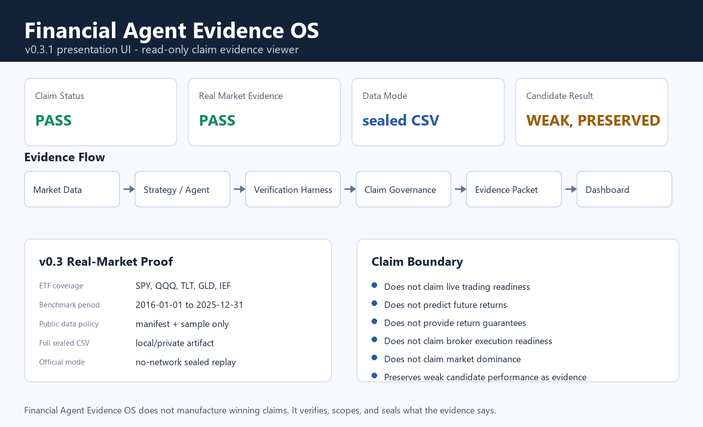

# Financial Agent Evidence OS

[](https://github.com/lloitesa013/stock-agent-harness-v0-2-0-defense/actions/workflows/stock-harness-ci.yml)

Financial AI claim verification reference architecture.

Not a trading bot. Not financial advice. Not live trading software.

This project verifies whether financial-agent performance claims are scoped,
reproducible, cost-aware, and sealed as reviewable evidence.



## Latest

- `v0.3.1-presentation-ui`: read-only executive dashboard and short demo package
  for the v0.3 evidence release.
- `v0.3-real-market-data-defense`: sealed ETF evidence for `SPY`, `QQQ`, `TLT`,
  `GLD`, and `IEF`; no live trading or future-return claim.
- `v0.2.0-defense`: performance-defense packet with strategy freeze, evidence
  manifests, and forward paper-trading protocol.

See the three-minute demo script: [docs/DEMO_SCRIPT_3_MIN.md](docs/DEMO_SCRIPT_3_MIN.md).

## Current Public Claim

> SOTA-grade downside-adjusted hypothetical backtested performance under the included deterministic `downside_performance_v1` benchmark suite.

This is a scoped benchmark claim. It is not financial advice, not live trading evidence, not a guaranteed-return claim, and not a universal market-dominance claim.

## Release Evidence

- One-page summary: [release_evidence/v0.2.0-defense-final/ONE_PAGE_SUMMARY.md](release_evidence/v0.2.0-defense-final/ONE_PAGE_SUMMARY.md)
- Release seal: [release_evidence/v0.2.0-defense-final/RELEASE_SEAL_MANIFEST.json](release_evidence/v0.2.0-defense-final/RELEASE_SEAL_MANIFEST.json)
- Technical paper: [release_evidence/v0.2.0-defense-final/paper/DOWNSIDE_PERFORMANCE_CLAIM_PAPER.pdf](release_evidence/v0.2.0-defense-final/paper/DOWNSIDE_PERFORMANCE_CLAIM_PAPER.pdf)
- Forward protocol: [release_evidence/v0.2.0-defense-final/forward/FORWARD_PAPER_TRADING_START.md](release_evidence/v0.2.0-defense-final/forward/FORWARD_PAPER_TRADING_START.md)
- Release note: [RELEASE_V0_2_0_DEFENSE.md](RELEASE_V0_2_0_DEFENSE.md)

## Productization Layer

The `v0.2.1-productization` work repositions the project as Financial Agent Evidence OS:

- Product vision: [docs/PRODUCT_VISION.md](docs/PRODUCT_VISION.md)
- Architecture: [docs/ARCHITECTURE.md](docs/ARCHITECTURE.md)
- UI spec: [docs/UI_SPEC.md](docs/UI_SPEC.md)
- Managing agent: [docs/MANAGING_AGENT.md](docs/MANAGING_AGENT.md)
- Comparison: [docs/COMPARISON.md](docs/COMPARISON.md)
- Pitch script: [docs/PITCH_SCRIPT.md](docs/PITCH_SCRIPT.md)
- Three-minute demo script: [docs/DEMO_SCRIPT_3_MIN.md](docs/DEMO_SCRIPT_3_MIN.md)
- Roadmap: [docs/ROADMAP.md](docs/ROADMAP.md)
- Risk disclosure: [docs/RISK_DISCLOSURE.md](docs/RISK_DISCLOSURE.md)

Run the read-only Streamlit evidence viewer:

```bash
pip install -r requirements-dashboard.txt
streamlit run dashboard/app.py
```

## v0.3 Real Market Data Defense

`v0.3-real-market-data-defense` extends Financial Agent Evidence OS from deterministic benchmark evidence to sealed real-market ETF evidence for `SPY`, `QQQ`, `TLT`, `GLD`, and `IEF` from `2016-01-01` through `2025-12-31`.

The real-market layer verifies that the Evidence OS works on sealed ETF OHLCV data. It does not expand the project into live trading software and does not create a future-return claim.

The public repository includes the real-market manifest, claim contract, and a tiny synthetic schema sample. Full provider-derived ETF CSV snapshots are not redistributed in the public repo because redistribution rights are unclear; keep them as local/private sealed artifacts or release assets with appropriate rights.

Run the sealed no-network gate when local/private sealed CSV artifacts are present:

```bash
python3 ops/run_real_market_data_defense.py --clean --pretty --output reports/real_market_data_defense_latest.json
```

Optional data refresh adapters are available, but refreshed data must be explicitly sealed before official use:

```bash
python3 ops/download_real_market_data.py --provider yahoo_chart --pretty
python3 ops/download_real_market_data.py --provider stooq --pretty
python3 ops/download_real_market_data.py --provider yfinance --pretty
```

The local sealed snapshot manifest records `yahoo_chart` as its provider. The Stooq adapter is retained as a stdlib downloader, but the public Stooq endpoint may require an API key depending on access policy. Official gates do not call any downloader. The candidate strategy showed weak real-market performance, and that result is intentionally preserved as evidence rather than converted into a promotional claim.

Ralph advisory tooling is available under [tools/ralph](tools/ralph/README.md). Ralph is optional, local-only, and not part of official evidence or CI.

Research-only infrastructure for deterministic, local verification of downside-aware stock backtests.

This project is not financial advice, not live trading software, not order routing, and not a broker integration. It is a no-network, CSV-based verification harness for testing whether simple stock-strategy research results survive downside-first checks, oracle parity, data-quality gates, and stress scenarios.

First-time Korean readers can start with [docs/FIRST_TIME_READER_GUIDE_KO.md](docs/FIRST_TIME_READER_GUIDE_KO.md).

## Claim Scope

The supported public claim is intentionally narrow:

> SOTA-grade deterministic verification coverage for local, no-dependency, downside-aware stock backtest research on the included `downside_verification_v1` benchmark suite.

This is a verification claim, not an alpha-generation claim. The harness does not claim superior returns, portfolio performance, market prediction skill, broker-grade execution realism, or dominance over all external backtesting engines.

See [docs/CLAIMS.md](docs/CLAIMS.md) for the exact claim language and non-claims.

## Three-Layer Claim Model

This repository now separates three different research claims:

1. `downside_verification_v1`: SOTA-grade deterministic verification coverage for local, no-dependency, downside-aware stock backtest research.
2. `agentic_verification_v1`: SOTA-inspired deterministic multi-agent verification workflow coverage integrated with the Stock Harness gates.
3. `downside_performance_v1`: SOTA-grade downside-adjusted hypothetical backtested performance under the included deterministic benchmark suite only.

The performance claim is deliberately scoped:

> SOTA-grade downside-adjusted hypothetical backtested performance under the included deterministic `downside_performance_v1` benchmark suite.

The performance layer compares `agentic_candidate_v1` against the included baselines and reports total return, CAGR, max drawdown, Sharpe, Sortino, Calmar, cost stress, walk-forward stability, data-quality gates, lookahead audits, and negative controls. It remains hypothetical backtested performance, not live trading evidence or a future-return claim.

Run the performance claim gate:

```bash
python3 ops/run_downside_performance_claim_gate.py --pretty --output reports/downside_performance_claim_gate_latest.json --evidence-dir dist/downside_performance_v1_claim_gate_evidence
```

See [docs/PERFORMANCE_CLAIMS.md](docs/PERFORMANCE_CLAIMS.md), [docs/PERFORMANCE_NON_CLAIMS.md](docs/PERFORMANCE_NON_CLAIMS.md), and [docs/PERFORMANCE_BENCHMARK_METHOD.md](docs/PERFORMANCE_BENCHMARK_METHOD.md) for the exact performance boundary.

Build the v0.2 performance-defense packet:

```bash
python3 ops/build_downside_performance_defense_packet.py --clean --pretty --forward-start-date 2026-05-27
python3 ops/verify_downside_performance_defense_packet.py --pretty
```

The defense packet adds strategy freeze evidence, data-lineage and bias disclosures, baseline-fairness checks, deterministic bootstrap confidence intervals, and a forward paper-trading protocol. See [docs/PERFORMANCE_DEFENSE.md](docs/PERFORMANCE_DEFENSE.md).

## What Is Verified

- OHLCV CSV loading with strict structural validation.
- Lagged moving-average-to-cash backtests with no lookahead trading.
- MDD-first verdicts and reproducible report writing.
- No-dependency oracle benchmark parity.
- Lookahead mutation audit.
- Walk-forward downside validation.
- Regime, parameter-overfit, cost, slippage, delay, gap, cash-yield, liquidity, and market-impact stress checks.
- Data-quality gates for invalid OHLCV rows, missing sessions, duplicate dates, zero volume, split-like jumps, adjusted price consistency, and market-calendar profiles.
- External-engine style parity for equity curves, trades, fills, and order intents.
- Multi-asset benchmark packs with per-case artifact bundles and experiment manifests.

## Local Validation

Run the stock harness unit suite:

```bash
python3 -m unittest tests/test_stock_harness.py
```

Run the deterministic benchmark:

```bash
python3 ops/benchmark_stock_harness.py --pretty
```

Run the public-claim evidence comparison:

```bash
python3 ops/compare_stock_harness_baselines.py --pretty
```

All stock harness commands are local-only and require no external Python packages. Set `STOCK_HARNESS_TMPDIR` when a runner requires temporary artifacts to stay under a specific writable directory.

## Release Gate

For official claim evidence, run:

```bash
python3 ops/run_stock_harness_official_claim_gate.py --pretty --output reports/stock_harness_official_claim_gate_latest.json
```

The official publication gate requires Python plus Cargo. It runs the full release gate, embeds that gate JSON into the evidence packet, verifies the packet and release candidate with `official_claim_ready: true`, replays the packaged source zip, and reports `official_claim_publishable: true` only when every scoped assertion passes. The final official claim packet is built with `ops/build_stock_harness_official_claim_packet.py`, verified with `ops/verify_stock_harness_official_claim_packet.py`, and published from `dist/stock_harness_official_claim_packet`. See [docs/RELEASE_GATE.md](docs/RELEASE_GATE.md) for the full gate, Python-only local mode, release bundle manifest, evidence packet, release candidate artifacts, release candidate replay, and official claim packet.

The lower-level release gate remains available as `ops/run_stock_harness_release_gate.py`; public release evidence should use the official publication gate above.

## Release Note

The repository includes an MIT license. Before publishing a release, keep the public claim scoped to `downside_verification_v1`, preserve the benchmark artifacts for the release tag, and avoid universal trading-system or external-framework dominance claims.
